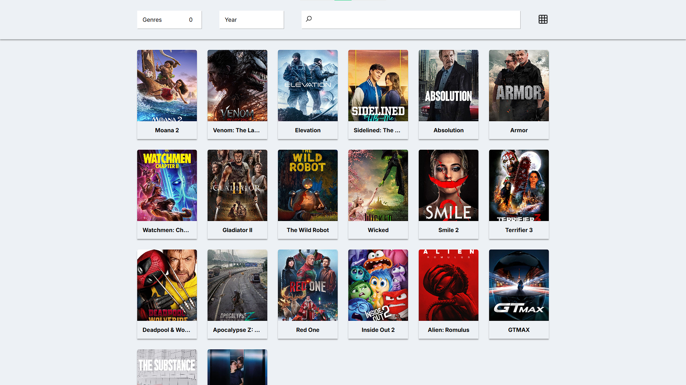

<h1 align="center"> MovSort 💻 </h1>

## Briefing 📄

- This app consumes the TMDB API to show a list of movies. 
- Movies can be filtered by genre and year. 
- It's possible to search for a movie within the current filters based on it's name.
- There is two options for layout, grid and list. List has more details about each movie.
- The API provides multiple pages of 20 items for each request. Therefore, the app has multiple pages in the bottom.

## Alerts ⚡

- This project may not be optimized to your screen. I used 1920x1080 screen during development.

- > [TMDB API Docs](https://developer.themoviedb.org/docs/getting-started)

- > [Live Project Link](https://movsort.netlify.app)

- > [Icons From Icons8](https://icons8.com)

## Goal 📌 

- Improve Typescript and MVC knowledge.

---

<h3 align="center"> Home 📷 </h3>

    

<h3 align="center"> Tecnologias utilizadas 🤖 </h3>

 > 

 >   
 >   
 > 

